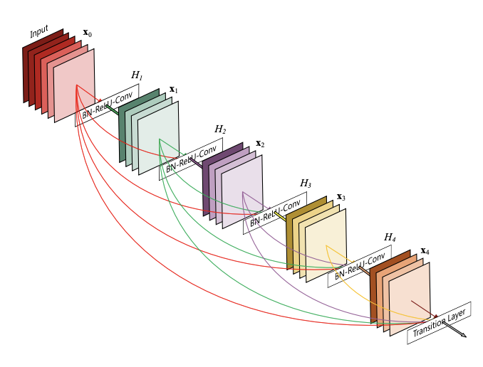

# 可视化经典模型的对比实验总结

---

## 环境安装

### 安装OpenGL

```shell
sudo apt-get install -y build-essential  libxmu-dev libgl1-mesa-glx libglu1-mesa-dev libgl1-mesa-dev freeglut3-dev libglew-dev libsdl2-dev libsdl2-image-dev libglm-dev libfreetype6-dev
```


### 安装Netron

网页版：https://netron.app/
官方下载：https://github.com/lutzroeder/netron


### 安装zetane

官方链接“”https://zetane.com/
GitHub链接：https://github.com/zetane/viewer


## AlexNet

Alexnet 是一个图像分类模型，其中输入是 1000 个不同类别（例如猫、狗等）之一的图像，输出是 1000 个数字的向量。
输出向量的第i个元素是输入图像属于第i类的概率；因此，输出向量的所有元素之和为 1。
AlexNet 的输入是大小为 224x224 像素的 RGB 图像。

模型设计图


Netron结构图


weights


bias


input (1,3,224,224)


Conv


Feature Maps


ReLU


MaxPool


整体结构图


feature0


feature3


feature6


feature8


feature10


classify


## VGG

模型设计图


Netron结构图


整体结构图


feature0


feature2


feature5


feature7


feature10


feature12


feature14


feature17


feature19


feature21


feature24


feature26


feature28


classifier


## GoogleNet
模型设计图


Netron网络图


zetane整体结构图


详细可视化
1


2


3


分支


m_1


m_2


m_3


m_4


for_epoch 9次


output_merge


end


## Inception_v3

也称为 GoogleNetv3，2015 年开始在 Imagenet 上训练的著名 ConvNet。

模型设计图


Netron结构图


zetane整体结构图


conv


分支


m_1


m_2


m_3


m_4


全局图


## DenseNet

密集卷积网络（DenseNet）以前馈方式将每一层连接到其他每一层。

网络设计图





Netron网络图


这个部分可以看做是一个基础组件的结构，后面大量嵌套并循环使用


局部图


第一部分


第二部分


第三部分-头


第三部分-尾


第四部分 


zetane网络图


## SqueezeNet

参数减少 50 倍的 Alexnet 级精度。

网络设计图


Netron网络图


Zetene整体图


细节

features.0 


features.3.squeeze


features.3.expand3x3


features.4


features.4.expand1x1


features.5.squeeze


features.5.expand3x3


features.7.squeeze


features.7.expand 


features.8.squeeze


features.8.expand 


features.9.squeeze


features.10.expand


features.10.squeeze


features.10.expand1x1


features.12.squeeze


features.12.expand.3x3


classifer.1


全局图


output


## ShuffleNet

一个针对速度和内存进行了优化的高效 ConvNet，在 Imagenet 上进行了预训练。

所有预训练模型都期望输入图像以相同的方式归一化，即形状为 的 3 通道 RGB 图像的小批量`(3 x H x W)`，其中`H`和`W`预计至少为`224`。必须将图像加载到 的范围内，然后使用 和`[0, 1]`进行归一化。`mean = [0.485, 0.456, 0.406]``std = [0.229, 0.224, 0.225]。

网络设计图


Netron网络图


Zetane整体图


p1


这里同样可以将几个重复的结构作为单独模块来理解分析，大致可分为两个组件和一个连接件。

组件一：包含两个输出层，输出层一包含三个Conv卷积和两个ReLu，输出层二包含两个Conv卷积和一个ReLu。


组件二：包含两个输出层，输出层一无其他操作直接输出，输出层二包含三个Conv卷积和两个ReLu。


连接件：这部分主要是用来连接组件模块设计的，包含Constant、Concat、Transpose、Reshape、Split。


先来预览下组件模块的效果

组件一


组件二


连接件：

concat


input_1 (24,28,28)


input_2 (24,28,28)


output (48,28,28)


Constant


Reshape


Transpose


Split

input (48,28,28)


output_1 (24,28,28)


output_2 (24,28,28)


模型组网

组网方式一


组网方式二


end


## ResNet


在 ImageNet 上预训练的深度残差网络

网络设计图


Netron网络图


Zetane整体图


局部细节

p1


p2


p3


p4


p5


p6


p7


p8


p9


p10


整体可视化


output 


## ResNext

下一代 ResNet，更高效、更准确

网络设计图


Netron结构图


Zetane整体图


局部细节图

下面是一个基本的结构，共包括两个输出层，其中一个输出层包含三个Conv卷积和两个ReLu，另一个输出层只包含一个Conv卷积。
最后合并两个输出通道的结果，输入下一层进行计算。


简单来看下效果


接下来是对上面基本结构的一个交叉循环，共计16个。


最终输出


output结果


## Wide_ResNet


                                
Netron网络图
                                                                                                                                                                                                                                                     


Zetane整体结构


p1


两个基本结构

结构一


结构二


下面分别来看下两个结构的可视化

结构一，分为两个输出层，一层仅包含一个Conv卷积，另外一层是包含三个Conv卷积和两个ReLu。


结构二，分为两个输出层，其中一层不包含操作，另外一层与结构一的第二层一样，包含三个Conv卷积和两个ReLu。


中间连接部分，主要是承上启下，将两个输出通道的输出结果进行叠加融合，重新进行ReLu传递给下面。


## RegNet

Netron网络图


Zetane整体图


两个基本结构

结构一


结构二


结构一

局部细节一


局部细节二


结构二


整体效果


局部细节

细节一


细节二


连接部分


结尾部分

